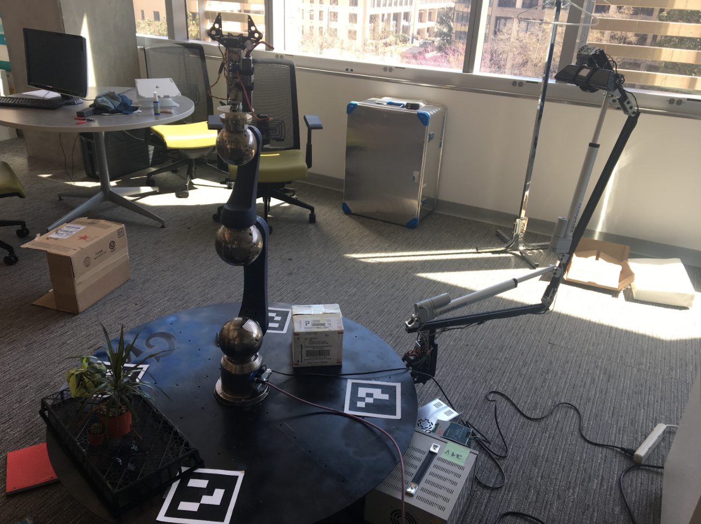

# BRIEF Visualization



Authors: A. Tarek Hatata & Thomas Magnan

This proposed project is an extension of a pre-existing “human-in-the-loop” application utilizing two robots and a turntable to image and grasp objects within a predetermined region. This project is referred to as the [Biological Robotic Imaging Experimentation Framework (BRIEF)](https://github.com/gw-cs-sd/sd-2017-BRIEF-Crandall).

This project focuses on advancement of the applications of the optical robotic arm. The end goal is to add functionality of the controlling GUI to easily move the arm and obtain images from other perspectives to build a refined 3D model of the object being imaged. Ideally this process can be automated through machine learning and analyzing an image stream to determine where another image is required.

The next stage of the project includes taking a series of images of this object over time and connecting the 3D models to create a 4D model where one can see the changes over time (the 4th dimension). An ideal object to model in three dimensional space over time is a plant, specifically a flower.

## Installation

### Hardware Components
- Turntable
Please refer to [BRIEF's other site](https://github.com/gw-cs-sd/sd-2017-BRIEF-Crandall) for details on installation of the hardware. It was not a relevant part of this addition as it is already setup and operational on the primary machine.

### Software & System Requirements

- OpenCV (3.3.0)
  - Easy installation guide [here](https://medium.com/@debugvn/installing-opencv-3-3-0-on-ubuntu-16-04-lts-7db376f9396)
  - **Must install additional contribution packages (Aruco)**
- VTK (6.3)
  - Install [here](https://www.vtk.org/Wiki/VTK/Configure_and_Build)
- Point Cloud Library (PCL)
  - Install [here](http://pointclouds.org/downloads/linux.html)
- Ubuntu Based Machine (14.04)

**Warning about using newer versions of libraries:** It caused a variety of issues when building out and these are what is already installed on the lab machine.

**Note:** The Microsoft Kinect Camera is **NOT** compatible with a Virtual Machine. If you are to do specific tests you must Utilize an Ubuntu-based machine.

## Source

Please refer to each respective subfolder for a deeper look into the functionality of each

For a deeper look into the architecture of our system please refer to our [Design Document](https://docs.google.com/document/d/15gEI3p_kkgORwE-nCUjNehDNtyYY_CgFskas9DObcVs/edit?usp=sharing)

## Modeling GUI integrated with BRIEF System
#### 1. Building

Note: If not using lab machine, clear the build folder to configure with your own system.
```
$ cd cameraarm/app/modeling_gui/ModelingWindow
$ mkdir build
$ cd build
$ cmake -DVTK_DIR:PATH=/home/workstation5/workplace/source/VTK5.10.1/build ..
$ make
```

Note: It's helpful to use ccmake to visualize the cmake build process and link your own libraries (e.g. replacing ```DVTK_DIR``` with correct path) by replacing the cmake line with ```ccmake ..``` If not already installed, run ```sudo apt-get install cmake-curses-gui``` to install.

#### 2. Connecting to the Raspberry Pi
1. Power on the Ubuntu 14.04 machine and log in.
2. Plug in the Raspberry Pi (RPi). Also, make sure that it is connected to the Ubuntu machine via ethernet cable. In the Wifi menu at the top right of the Ubuntu machine, make sure that 'RPi' is selected.
3. Plug in the XBox Kinect. A green LED on the Kinect should light up. If this light  does not appear, trace the wire and check its connection. Also, make sure that it is connected to the Ubuntu machine via USB.

Note: _Do **not**_ yet power on the power strip that supplies the linear actuators and stepper motor.

4. Open up **2** terminal windows on the Ubuntu machine.
5. In the first terminal, navigate to `/cameraarm/app/`.
6. Run `./sshRPi.sh` to ssh into the RPi. You will have to type the password (trumpet1).
7. On the RPi, run `./runServer.sh` and leave it alone.
8. In the second terminal window, navigate to `/cameraarm/app/modeling_gui/ModelingWindow/build/`. This is where you will run your application.
9. Finally, power on the power strip that supplies the linear actuators and stepper motor.

#### 3. Executing GUI
```
$ ./ModelingWindow 44
```
Upon initialization of the GUI ```move.py``` is called from within ```ModelingWindow/src/``` which runs the socket communication with the arm via the Raspberry Pi. The app will crash if Step 2 is not followed properly.

#### 4. Turning off the system

1. Begin by saving your model and exiting the application
2. **Important** Currently ```KinectScan and move.py``` are being run in the background. Go to System Monitor and find the processes and kill them. Otherwise images will continue to be taken.
3. Turn off the Hardware
  1. Turn off the power strip that supplies the linear actuators and the stepper motor.
  2. On the Ubuntu machine, in the terminal window that is logged into the RPi via ssh
  	1. Kill the motorSever by hitting Ctrl+c.
  	2. Run `./shutdown.sh`.
  	3. Run `exit` to close the ssh connection.
  	4. Close the terminal window on the Ubuntu machine.
  	5. Wait 10 seconds, double check that you have completed Step 1, then unplug the RPi.
  3. Unplug the XBox Kinect.
  ###### Important Tips:
  **1. Do not turn on/off linear actuator power strip without having RPi plugged in.**
  * The RPi powers the Arduino Uno via its USB connection. The Arduino's setup() method (which is called when the Arduino is first powered on) tells the linear actuators what their default positions should be. If the linear actuators do not have this constant signal from the Arduino Uno, the actuators default to 90 degrees.
  * Likewise, if you turn off the RPi (which will also turn off the Arduino Uno) before shutting off the power to the actuators, the actuators will default to 90 degrees because they will not have the signal from the Arduino.

  **2. Follow proper steps for powering off the RPi.**
  * If you do not do this, the RPi may be stuck in recovery mode. If this happens, you will need to plug a keyboard, monitor, and mouse into the RPi to diagnose the issue and escape recovery mode.

## Using the Modeling GUI with static images
This version of the application allows a user to utilize the modeling technology given any set of images from a scan to build the model.

Refer to ```/cameraarm/app/modeling_static/``` for a README with specific instructions for this application.

## Tips

### Working on the Project from Home :: Remote Desktop, SSH, Remote Atom
For the purposes of the project it is best to keep the source code on the one lab machine that operates the robot. This can make things difficult to work on the project and using a [**Remote Desktop**](https://www.tecmint.com/enable-desktop-sharing-in-ubuntu-linux-mint/) or [**SSH combined with remote atom**](https://atom.io/packages/remote-atom) makes it much easier.

## Current Stages of Development and Next Steps

Over the past year we have made advances towards efficient modeling. We have created an easy to use GUI, efficient architecture, and base algorithms regarding modeling, calibration, and actuation.  

Further research would be best focused on optimizing the snapping technology and location determination. We believe that the snapping is not as accurate as it could be due to inaccurate location data. And due to this data also facing troubles with requesting actuation to certain points in space. Movement is believed to be functional but minimal physical tests have been done to confirm that such is the case due to time.

###### Understanding the code base
Read through all of the code in ```cameraarm``` directory and read through our [Design Document](https://docs.google.com/document/d/15gEI3p_kkgORwE-nCUjNehDNtyYY_CgFskas9DObcVs/edit?usp=sharing)

###### Additional README's
Additional README's can be found within [```/cameraarm/app/modeling_static/```](https://github.com/gw-cs-sd/sd-18-hatata_magnan/tree/master/cameraarm/app/modeling_static/),  [```/cameraarm/app/calibration_actuation/```](https://github.com/gw-cs-sd/sd-18-hatata_magnan/tree/master/cameraarm/app/calibration_actuation/), and [```/cameraarm/app/modeling_gui/```](https://github.com/gw-cs-sd/sd-18-hatata_magnan/tree/master/cameraarm/app/modeling_gui) to describe some of the functionality of each section in further detail
